# Overtide

Osobisty tracker nadgodzin dla [Redmine](https://www.redmine.org/). Synchronizuje wpisy czasu **Nadgodziny** i zgłoszenia **Odbiór nadgodzin** do lokalnej bazy SQLite, łączy je algorytmem FIFO i pokazuje w szybkim, ciemnym UI ile godzin nadgodzin masz jeszcze do odebrania.

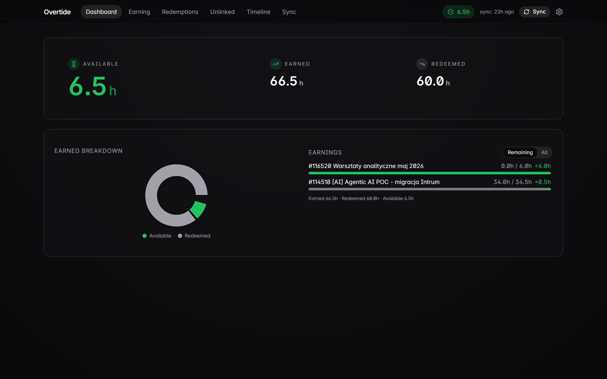

> Aplikacja jednoosobowa, lokalna. Nasłuchuje wyłącznie na `127.0.0.1`. Żadnej chmury, żadnej telemetrii — Twoje dane zostają na Twoim komputerze.

---

## Spis treści

- [Co to robi](#co-to-robi)
- [Jak to działa](#jak-to-działa)
- [Uruchomienie lokalne](#uruchomienie-lokalne)
- [Ekrany](#ekrany)
  - [Dashboard](#dashboard)
  - [Earning — wyrobione nadgodziny](#earning--wyrobione-nadgodziny)
  - [Redemptions — odbiory nadgodzin](#redemptions--odbiory-nadgodzin)
  - [Kreator nowego odbioru](#kreator-nowego-odbioru)
  - [Unlinked](#unlinked)
  - [Timeline](#timeline)
  - [Sync](#sync)
  - [Szczegóły zgłoszenia](#szczegóły-zgłoszenia)
  - [Settings](#settings)
  - [Command palette](#command-palette)
- [HTTP API](#http-api)
- [Stack technologiczny](#stack-technologiczny)
- [Struktura repo](#struktura-repo)
- [Testy](#testy)

---

## Co to robi

Logowanie nadgodzin w Redmine jest proste: bukujesz godziny na zwykłym zgłoszeniu pod aktywnością czasu **Nadgodziny**. Odbiór nadgodzin jest trudniejszy — tworzysz osobne zgłoszenie pod trackerem **Odbiór nadgodzin** za dni wolne i łączysz je relacją `relates` ze źródłowymi zgłoszeniami z wyrobionymi nadgodzinami, żeby HR/PM widzieli skąd odebrane godziny się wzięły.

Robiąc to ręcznie praktycznie nie da się odpowiedzieć na pytanie „ile godzin nadgodzin tak naprawdę mi zostało?” bez arkusza w Excelu. Overtide odpowiada na to pytanie na bieżąco:

- Pobiera każdy wpis czasu `Nadgodziny` i każde zgłoszenie odbioru z Redmine.
- Przechodzi po istniejącym grafie `relates` ustalając które godziny odbioru są już „opłacone” z których wyrobionych nadgodzin.
- Resztę dopasowuje algorytmem **FIFO** — najstarsze wyrobione godziny konsumowane jako pierwsze.
- Pokazuje `available = earned − redeemed` oraz pozostałości per zgłoszenie.
- Pozwala stworzyć nowy odbiór jednym kliknięciem — relacje `relates` i overrides `allocated_hours` są zapisywane prosto z powrotem do Redmine.

## Jak to działa

```
[Redmine REST API]
        ▲
        │  GET /users/current, /time_entries, /issues (include=relations)
        │  POST /issues/{id}/relations         (write-through)
        │  POST /issues + /time_entries        (kreator nowego odbioru)
        │
   ┌────┴──────────┐
   │   api (Bun)   │── Drizzle ─► SQLite (apps/api/data/overtide.db)
   │ Hono routes   │     • issues, time_entries, issue_relations
   │ FIFO matching │     • sync_runs, app_config
   └────▲──────────┘
        │  REST + envelope zod ({ data } | { error })
        │
   ┌────┴──────────┐
   │   web (Vite)  │  React 18 + TanStack Router/Query +
   │               │  shadcn/ui + Tailwind + Framer Motion +
   │               │  Recharts + cmdk
   └───────────────┘
```

- **API** to serwis Bun + Hono — to on rozmawia z Redmine i zapisuje wszystko do lokalnego SQLite przez Drizzle. Matcher FIFO jest czystą funkcją, łatwą do przetestowania.
- **Web** to SPA w Vite/React, która rozmawia wyłącznie z lokalnym API. Routing oparty na plikach (TanStack Router), pobieranie danych przez TanStack Query, animacje przez Framer Motion.
- **Sync** jest na żądanie: klikasz **Sync** (albo `POST /api/sync`) i API ściąga deltę z Redmine, przepuszcza wynik przez FIFO i zwraca świeży stan.

## Uruchomienie lokalne

Potrzebujesz:

- Bun ≥ 1.3
- Instancja Redmine z włączonym REST API
- Login + hasło do Redmine (lub klucz API)
- Numeryczne ID dwóch obiektów Redmine: trackera **Odbiór nadgodzin** i aktywności czasu **Nadgodziny** (patrz [Jak znaleźć ID](#jak-znaleźć-id-trackera--aktywności))

```bash
bun install
cp .env.example apps/api/.env
# edytuj apps/api/.env — patrz niżej

bun --filter @overtide/api db:migrate
bun --filter @overtide/api dev &
bun --filter @overtide/web dev
# otwórz http://127.0.0.1:5173
```

Vite dev server proxuje `/api/*` → `http://127.0.0.1:8787` (Bun API).

### Ściąga do `.env`

```ini
REDMINE_URL=https://twoj-redmine.example.com
REDMINE_USERNAME=twoj.login
REDMINE_PASSWORD=twoje-haslo
# (lub REDMINE_API_KEY=...  — wygrywa nad parą login/hasło)

REDMINE_TRACKER_REDEMPTION_ID=<id trackera "Odbiór nadgodzin">
REDMINE_ACTIVITY_OVERTIME_ID=<id aktywności "Nadgodziny">

# Opcjonalne — tylko dla in-app kreatora "New redemption":
REDMINE_VACATIONS_PROJECT_ID=<id projektu "Urlopy">
REDMINE_REDEMPTION_ACTIVITY_ID=<id aktywności używanej na zgłoszeniach odbioru>

USER_INITIALS=OB   # override; jak puste — wyciągane z konta Redmine
```

### Launcher dla Windowsa

`dev.cmd` (root repo) ubija stałe child processy nodea/buna — Windows lubi trzymać port 5173 po crashu vite — i odpala api + web w dwóch nowych oknach `cmd`.

```cmd
dev.cmd              :: reset + start oboje
dev.cmd --no-reset   :: tylko start (bez ubijania)
dev.cmd --kill       :: tylko ubicie, przydatne przed re-runem
```

### Jak znaleźć ID trackera / aktywności

Jak tylko credki działają, samo Redmine je serwuje:

```bash
curl -u "$LOGIN:$PASS" https://twoj-redmine.example.com/trackers.json
curl -u "$LOGIN:$PASS" https://twoj-redmine.example.com/enumerations/time_entry_activities.json
```

---

## Ekrany

Górny pasek jest stały: nazwa, nawigacja, „pigułka” z aktualnym **Available**, badge „ostatni sync N temu”, przycisk Sync i koło zębate ustawień. Praktycznie każda liczba w UI reaguje na świeży sync.

### Dashboard

`/` — strona startowa. Trzy duże liczby: **Available** (jedyna, która liczy się na co dzień), **Earned** (wyrobione) i **Redeemed** (odebrane). Pod spodem donut chart pokazuje gdzie poszły wyrobione godziny, a lista po prawej — które zgłoszenia mają jeszcze godziny do wydania.


Przełącznik **Remaining / All** po prawej przerzuca listę wyrobionych nadgodzin między „tylko z resztą do odebrania” a „wszystko, posortowane od największego źródła”. Klik w wiersz → przeskok do widoku szczegółów tego zgłoszenia.

### Earning — wyrobione nadgodziny

`/earning` — każde zgłoszenie Redmine, na którym zalogowałeś nadgodziny. Kolumny: **Earned** (suma wpisów `Nadgodziny`, czyli wyrobione godziny), **Consumed** (ile FIFO już rozdysponował na odbiory), **Remaining** (ile zostało w banku), plus deeplink do Redmine.

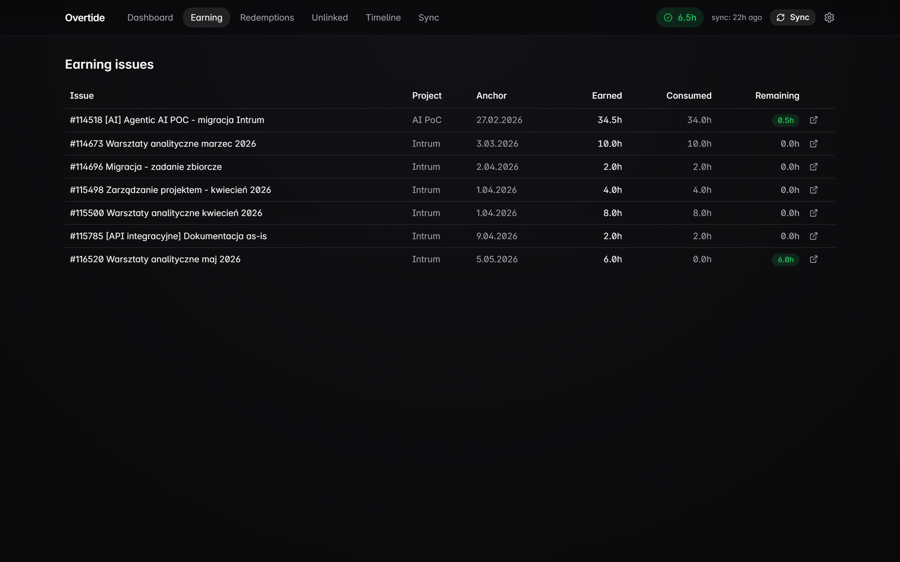

Sortowanie domyślnie od najnowszych; pole „Remaining” świeci na zielono, jeśli zostało jeszcze coś do odebrania.

### Redemptions — odbiory nadgodzin

`/redemptions` — druga strona księgi: każde zgłoszenie **Odbiór nadgodzin**, ile godzin zażądało, ile już pokrytych z połączonych wyrobionych nadgodzin i z których wyrobionych zgłoszeń pochodzą. Kolumna **Linked OT** pokazuje numery zgłoszeń, z którymi odbiór jest połączony przez `relates`.

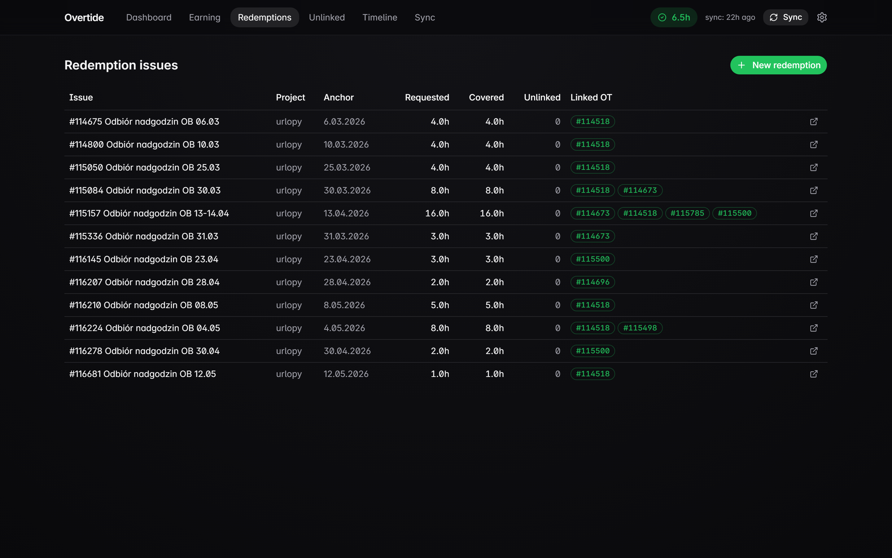

`Unlinked` to liczba godzin odbioru, które wciąż nie mają linka `relates` — kolumna, którą chcesz mieć na zero.

### Kreator nowego odbioru

Zielony przycisk **+ New redemption** (prawy górny róg `/redemptions`) otwiera kreator w 4 krokach:

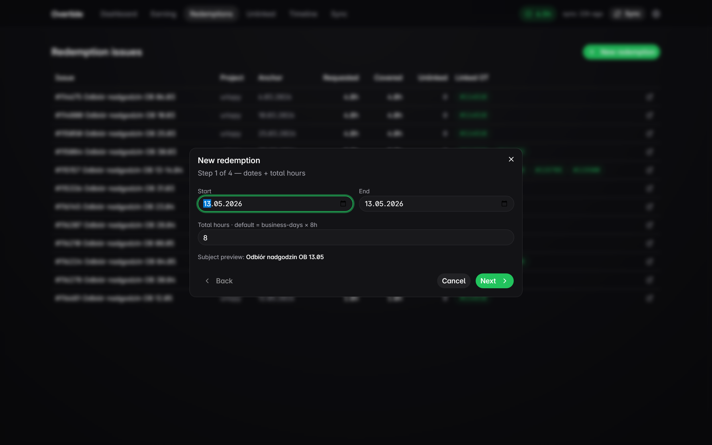

1. **Daty + suma godzin** — domyślnie dzisiaj i standardowy rachunek 8h/dzień roboczy; subject auto-formatuje się do `Odbiór nadgodzin <INICJAŁY> DD.MM`.
2. **Allocations** — wybierasz z których wyrobionych zgłoszeń pociągnąć godziny; domyślnie FIFO po resztach.
3. **Time entries** — po jednym wpisie czasu na każdy dzień roboczy w zakresie, pod skonfigurowaną aktywnością odbioru.
4. **Confirm** — preview wszystkiego i submit.

Po zatwierdzeniu kreator tworzy zgłoszenie odbioru, dopisuje wpisy czasu i zapisuje po `relates` per wyrobione zgłoszenie (z `allocated_hours` jako override) — wszystko przez REST API Redmine. W tej samej transakcji wszystko ląduje też w lokalnym SQLite, a w UI pojawia się toast z numerem nowo utworzonego zgłoszenia:

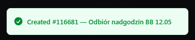

### Unlinked

`/unlinked` — każde zgłoszenie odbioru z `unlinked > 0`. Jak wszystko jest pospinane, dostajesz empty state:

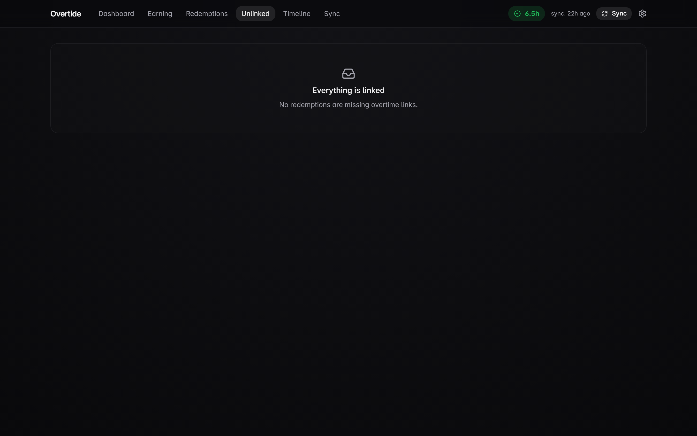

Jak są niespięte wiersze, każdy ma przycisk **Pick earning to link** otwierający side panel z kwalifikującymi się zgłoszeniami wyrobionych nadgodzin (filtrowanymi po reszcie godzin) i suwakami do alokacji. Klik **Link** → zapis `relates` do Redmine i aktualizacja lustra.

### Timeline

`/timeline` — saldo Twojego banku nadgodzin w czasie. Zielony obszar to skumulowany **Available**; zielone słupki to dzienne wyrobione godziny, czerwone — dzienne odbiory.

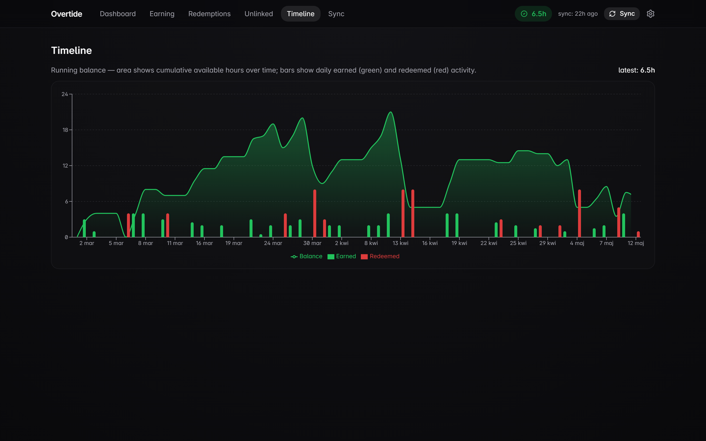

Przydatne do wyłapywania wzorców („w marcu zawsze zbieram, w maju zawsze palę”) i sprawdzenia że matcher FIFO nie schodzi pod zero.

### Sync

`/sync` — historia każdego sync runa: liczniki (zsynchronizowane zgłoszenia / wpisy czasu / relacje) i komunikaty błędów z runów, które się wywróciły.

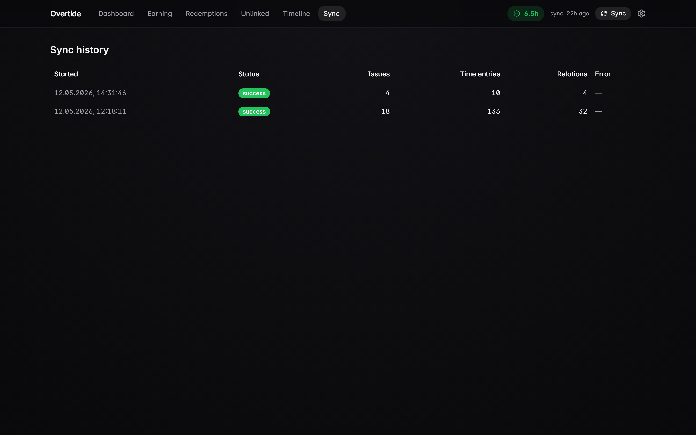

Pierwszy pełny sync na żywym Redmine z tysiącami wpisów czasu zajmuje ~90 sekund; kolejne delty są podsekundowe.

### Szczegóły zgłoszenia

`/issue/:id` — drill-down do jednego zgłoszenia: każdy wpis czasu, który się złożył na sumę, każda relacja (i z której strony) oraz deeplink do Redmine.

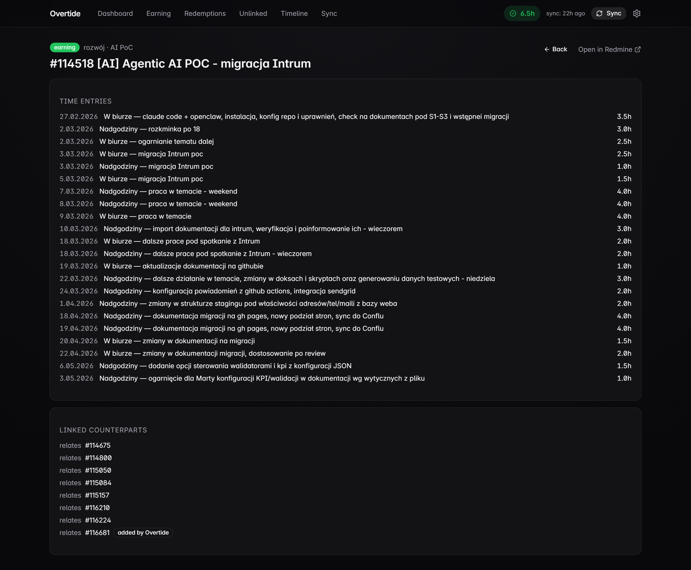

Sekcja **LINKED COUNTERPARTS** to „papierowy ślad” FIFO — dla wyrobionego zgłoszenia lista wszystkich odbiorów które z niego pobrały; dla odbioru lista wszystkich wyrobionych zgłoszeń, które za niego zapłaciły.

### Settings

`/settings` — minimalne z założenia: stan połączenia z Redmine + czas ostatniego udanego synca. Reszta siedzi w `.env`.

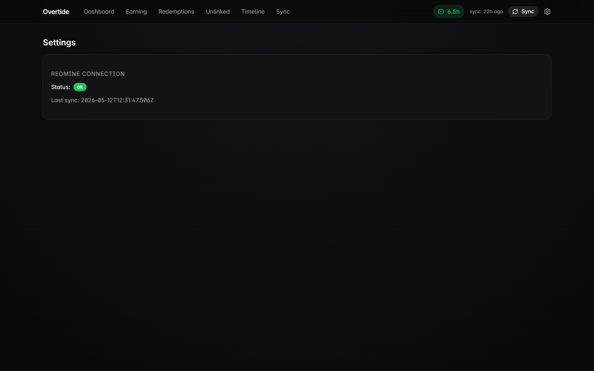

### Command palette

`Ctrl/Cmd + K` z dowolnego miejsca — fuzzy-jump do dowolnej strony albo trigger synca bez ruszania klawiatury.

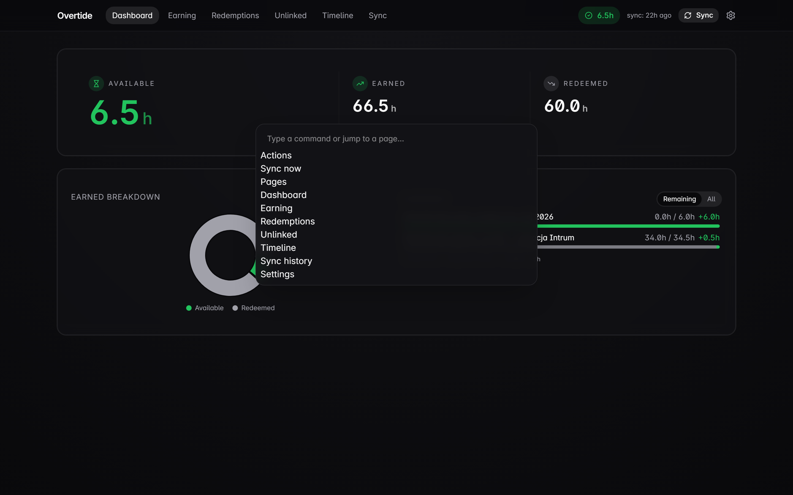

---

## HTTP API

Wszystkie odpowiedzi w typowanym envelope: `{ data: T }` przy sukcesie, `{ error: { code, message, details? } }` przy błędzie.

| Endpoint | Metoda | Co robi |
|---|---|---|
| `/api/health` | GET | Dostępność Redmine + status DB + ostatni sync |
| `/api/sync` | POST | Wymuszenie synca (blocking, ~90s przy zimnym starcie z 10k+ wpisów czasu) |
| `/api/sync/history?limit=N` | GET | Ostatnie N sync runów |
| `/api/sync/:id` | GET | Jeden sync run |
| `/api/balance` | GET | `{ earned, redeemed, available, unlinkedHours }` |
| `/api/balance/timeline?bucket=month` | GET | Seria miesięczna dla wykresu Timeline |
| `/api/issues/earning` | GET | Zgłoszenia z wyrobionymi nadgodzinami: `earned/consumed/remaining` po FIFO |
| `/api/issues/redemption` | GET | Zgłoszenia odbiorów nadgodzin: `requested/covered/unlinked` |
| `/api/issues/:id` | GET | Jedno zgłoszenie + wpisy czasu + relacje |
| `/api/unlinked` | GET | Odbiory z `unlinked > 0` (wymagają ręcznego linka) |
| `/api/relations` | POST | Body `{ from_earning_id, to_redemption_id }` — tworzy `relates` w Redmine + lustro |
| `/api/relations/:id` | DELETE | Tylko relacje stworzone lokalnie |
| `/api/redemptions/create` | POST | Body `{ startDate, endDate, totalHours, allocations[] }` — tworzy zgłoszenie odbioru, jego wpisy czasu i `relates` per wyrobione zgłoszenie z override’ami `allocated_hours`; wszystko mirrorowane do lokalnego SQLite. Pod spodem kreatora **New redemption**. |

---

## Stack technologiczny

- **Runtime:** Bun 1.3
- **Backend:** Hono 4 (HTTP), Drizzle ORM 0.36 + `bun:sqlite`, zod 3, pino (z redakcją sekretów)
- **Frontend:** React 18, Vite, TanStack Router + Query, shadcn/ui, Tailwind, Framer Motion, Recharts, cmdk, lucide-react
- **Testy:** `bun test` w `apps/api` i `packages/shared` (vitest 2.x nie potrafi rezolwować `bun:sqlite` na Windowsie); Vitest w `apps/web` (unit + komponenty); MSW do mockowania HTTP, `@sinonjs/fake-timers` do testów retry, Playwright do smoke E2E
- **TypeScript:** strict, `noUncheckedIndexedAccess`, `exactOptionalPropertyTypes`
- **Auth do Redmine:** HTTP Basic domyślnie; API key jako override
- **Binding:** wyłącznie `127.0.0.1`

## Struktura repo

```
overtide/
├── apps/
│   ├── api/                  # Bun + Hono + Drizzle backend
│   │   ├── src/
│   │   │   ├── config/       # loader env oparty o zod
│   │   │   ├── db/           # schema + zapytania Drizzle
│   │   │   ├── lib/          # logger, envelope odpowiedzi
│   │   │   ├── matching/     # algorytm FIFO (pure)
│   │   │   ├── middleware/
│   │   │   ├── redmine/      # typowany klient REST
│   │   │   ├── routes/       # handlery Hono
│   │   │   └── sync/         # orchestrator + normalizery
│   │   ├── drizzle/          # migracje SQL
│   │   └── test/fixtures/redmine/
│   └── web/                  # Vite + React + TanStack frontend
│       ├── src/
│       │   ├── api/          # query / mutation hooki
│       │   ├── components/   # UI (oparte o shadcn)
│       │   ├── lib/          # helpery formatujące
│       │   └── routes/       # file-based routes TanStack
│       └── e2e/              # smoke testy Playwright
├── packages/
│   └── shared/               # schematy zod + typy (api + web)
└── docs/
    ├── screenshots/          # obrazki z tego README
    └── superpowers/          # spec designu + plany implementacji
```

## Testy

```bash
bun --filter @overtide/api test    # 57 testów backendu (Bun + MSW)
bun --filter @overtide/web test    # vitest — unit + komponenty
bun --filter @overtide/web e2e     # Playwright smoke (odpala oba serwery)
cd packages/shared && bun test     # 19 testów schematów współdzielonych
```

## Licencja

Prywatne — nielicencjonowane do dystrybucji.
